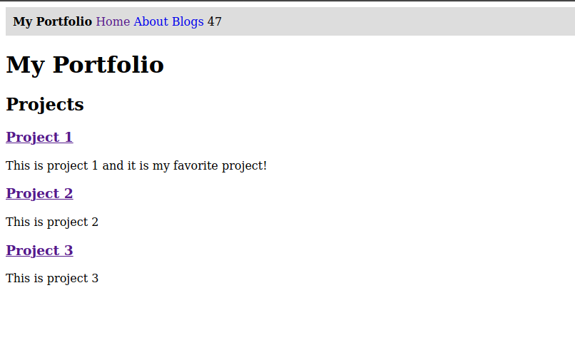

{{ const { meta, globalMeta } = Abell }}
# Tutorial

{{ meta.description }}

*Note that this section covers building Abell app from scratch and is intended to teaching the concepts rather than building. If you want to get something running quickly, you can check out [Abell Starters](../../starters/)*

## What are we building?

In this tutorial, we will be building **a Portfolio** with a projects, about, and blogs section. The data of projects will come from a JSON file, the information of about will come from a Markdown file, and blogs will come from markdown file as well. 

Even if you don't want a portfolio, It is still recommended to go through this Tutorial as it covers most of the Abell's features and will help you understand Abell better.

### What we will focus in this tutorial

- Reading from JSON
- Reading from Markdown
- Looping over `content` directory to dynamically create blog pages

### What we will NOT focus in this tutorial

- CSS and styling

## Prerequisites

- Abell requires basic knowledge of HTML, CSS, and JavaScript to edit layout of the page.
- For syntax highlighting and snippets in `.abell` files, you can install [Abell Language Features Extension for VSCode](https://marketplace.visualstudio.com/items?itemName=saurabh.abell-language-features) (We will be adding support for other editors soon)

---
## Table of Content

- [Overview](#overview)
- [Setup for the Tutorial](#setup-for-the-tutorial)
- [Exploring the Starter Code](#exploring-the-starter-code)
  - [abell.config.js](#abellconfigjs)
  - [theme/index.abell](#themeindexabell)
  - [theme/components/Navbar.abell](#themecomponentsnavbarabell)
- [Reading Data from JSON File](#reading-data-from-json-file)
- [Reading Data from Markdown](#reading-data-from-markdown)
- [Dynamic Page Generation from Content](#dynamic-page-generation-from-content)
  - [Writing Blog](#writing-blog)
  - [Creating Blog Layout](#creating-blog-layout)
  - [Listing Blogs on Index Page](#listing-blogs-on-index-page)
---

## Overview

Abell files are like HTML files but you can write JavaScript inside double curly brackets. This JavaScript code is executed and outputs a plain HTML file.

**Input (.abell)**

`index.abell`
```abell
\{{ 
  const a = 'Hello';
  const b = ', World 🌻';
}}

<html>
  <body>
    I can render JavaScript! Look: \{{ a + b.toUpperCase() }}
  </body>
</html>
```

**Output (.html)**

`index.html`
```html
<html>
  <body>
    I can render JavaScript! Look: Hello, WORLD 🌻
  </body>
</html>
```

[](https://codesandbox.io/s/abell-hello-world-zit90?fontsize=14&hidenavigation=1&module=%2Ftheme%2Findex.abell&theme=dark)


Notice how `.toUpperCase()` (which is a native Node.js function) upper cased the "WORLD". Thus, you can use any Native Node.js functions inside double curly brackets.

## Setup for the Tutorial

Let's build our portfolio now!

**Step 1.** Execute `npx create-abell-app my-portfolio --template minimal` in your terminal. <br/>This will create a minimal abell project and will install all the dependencies (including abell itself). 

Now your project will have following files.
```sh
📂 theme/
|   |- 📂 components
        |- 📄 Navbar.abell
|   |- 📄 index.abell
|- ⚙️ abell.config.js
|- ⚙️ package.json
```

And other files such as `package-lock.json`, `.gitignore` which we won't care about much in this tutorial.

**Step 2.** Run `npm run dev` to start a dev-server. This will run a live-reload server on <a target="_blank" href="http://localhost:5000">http://localhost:5000</a>


<details>
    <summary>`create-abell-app` adds a starter code, installs abell, and adds basic configs</summary>
      
`npx create-abell-app my-portfolio --template minimal` is equivalent to following steps:

- Create `./theme/index.abell`, `./theme/components/Navbar.abell`, `./abell.config.js`
- Execute `npm install --save-dev abell` to install abell
- In "scripts" key inside `package.json`, add `"dev": "abell serve"` and `"build": "abell build"`.
- Add following code to `abell.config.js` 
```js
module.exports = {
  themePath: 'theme',
  globalMeta: {
    siteTitle: 'My Portfolio'
  }
}
```
- Add following code to `./theme/index.abell`
```abell
\{{
  const { globalMeta, $root } = Abell; // JavaScript Destructuring

  const Navbar = require('./components/Navbar.abell');
}}

<html>
  <head>
    <title>\{{ globalMeta.siteTitle }}</title>
  </head>
  <body>
    <Navbar props={brand: globalMeta.siteTitle, $root: $root} />
    <main>
      <h1>\{{ globalMeta.siteTitle }}</h1>
    </main>
  </body>
</html>
```

- And in `./theme/components/Navbar.abell`, Add
```abell
<AbellComponent>
\{{ const { $root, brand } = props; }}

<template>
  <nav id="top-nav">
    <span class="brand">\{{ brand }}</span>
    <span class="links">
      <a href="\{{$root}}">Home</a>
      <a href="\{{$root}}#about">About</a>
      <a href="\{{$root}}#blogs">Blogs</a>
    </span>
    <span class="counter">0</span>
  </nav>
</template>

<style>
  nav#top-nav {
    padding: 10px;
    background-color: #ddd;
  }

  nav#top-nav a {
    text-decoration: none;
  }

  nav#top-nav .brand {
    font-weight: bold;
  }
</style>

<script>
  // Client-side JavaScript code goes here!
  let i = 0;
  setInterval(() => {
    document.querySelector('nav#top-nav .counter').innerText = ++i
  }, 1000)
</script>
</AbellComponent>
```
    
</details>


## Exploring the Starter Code.

[](https://codesandbox.io/s/create-abell-app-minimal-93hgf?fontsize=14&hidenavigation=1&module=%2Ftheme%2Findex.abell&theme=dark)

In our starter project, there are three major files that we have to care about.

- `abell.config.js` - All Abell Configurations (Installed plungins, global variables, paths of folder) go into this file
- `./theme/index.abell` - This file, in output, becomes `./index.html`. 
- `./theme/components/Navbar.abell` - Reusable Navbar Component. It is imported in `./theme/index.abell`

### abell.config.js

```js
// abell.config.js
module.exports = {
  themePath: 'theme',
  globalMeta: {
    siteTitle: 'My Portfolio'
  }
}
```

We can define any variable in `globalMeta` object and use it inside abell page. (E.g. We can use siteTitle variable from `./theme/index.abell` file with `Abell.globalMeta.siteTitle`

### theme/index.abell

```abell
\{{
  const { globalMeta, $root } = Abell; // JavaScript Destructuring

  const Navbar = require('./components/Navbar.abell');
}}

<html>
  <head>
    <title>\{{ globalMeta.siteTitle }}</title>
  </head>
  <body>
    <Navbar props={brand: globalMeta.siteTitle, $root: $root} />
    <main>
      <h1>\{{ globalMeta.siteTitle }}</h1>
    </main>
  </body>
</html>
```

There are few things happening here
1. We've added siteTitle from `abell.config.js` to `<title>` of our page and inside `<h1>`
2. We `require` Navbar.abell component and then we're passing to values as `props`. `brand` and `$root`

In Abell, `Abell.$root` variable holds a path to the project root. We can use this variable to ensure our paths are exactly relative to root.

E.g. `` will make sure that you are always referring to the `./theme/favicon.ico` no matter which file you're calling it from.

#### Q and A
- **Where did `Abell` variable come from?**<br/>
`Abell` variable is by default accessible from every abell page. You can `\{{ console.log(Abell) }}` to see its content (The data will be printed on your terminal which is running dev-server).
- **What is `const { globalMeta } = Abell;`** ?<br/>
It is called as "Destructuring" in JavaScript. It is equivalent to `const globalMeta = Abell.globalMeta`. <br/><a target="_blank" href="https://developer.mozilla.org/en-US/docs/Web/JavaScript/Reference/Operators/Destructuring_assignment">Read more about JavaScript Destructuring</a>
- **Why require and why not import?**<br/>The JavaScript inside brackets is executed on build and not during client-side thus it follows Node.js conventions.


### theme/components/Navbar.abell

```html
<AbellComponent>
\{{ const { $root, brand } = props; }}

<template>
  <nav id="top-nav">
    <span class="brand">\{{ brand }}</span>
    <span class="links">
      <a href="\{{ $root }}">Home</a>
      <a href="\{{ $root }}#about">About</a>
      <a href="\{{ $root }}#blogs">Blogs</a>
    </span>
    <span class="counter">0</span>
  </nav>
</template>

<style>
  nav#top-nav {
    padding: 10px;
    background-color: #ddd;
  }

  nav#top-nav a {
    text-decoration: none;
  }

  nav#top-nav .brand {
    font-weight: bold;
  }
</style>

<script>
  // Client-side JavaScript code goes here!
  let i = 0;
  setInterval(() => {
    document.querySelector('nav#top-nav .counter').innerText = ++i
  }, 1000)
</script>
</AbellComponent>
```

Abell Components have `<template>`, `<style?`, and `<script>` tag wrapped inside a `<AbellComponent>` tag.

Remember how in 'theme/index.abell' we passed brand and $root from props with `<Nav props={brand: globalMeta.siteTitle, $root: $root} />`? we can access these variables from `props` object inside that component. 

*Note: `props` is the only possible attribute to Abell Components. So you cannot `<Nav foo="something"/>` and expect a `foo` variable in component. It only works for `props` so a right way to tackle such usecase is to pass `<Nav props={foo: 'something'} />` and access with `props.foo`*


By default, all style from components is bundled into single file during output. But if a certain component is important, you can inline the style by adding `inlined` attribute to style or script tag. We will see this while building our portfolio.

#### Q and A
- **Are these styles and scripts, scoped?**<br/>
Unfortunately not. But we have plans to scope it in next versions of Abell. Till then, as you can see in the example, it is a good practice to give id to outer element and write styles and scripts with respect to that id so that you can be sure about the scope.


## Reading Data from JSON File

Let's start writing code now! First we will create a **Projects Section**. We will be reading our projects data from a JSON file so that when we want to add a new project, we can just add values to array instead of writing new HTML for it.

Lets start by creating a `projects.json` file. It is a good practice to have your data in `./theme/data/` folder. 

We will create `./theme/data/projects.json` file with following content
```json
[
  {
    "title": "Project 1",
    "url": "https://github.com/abelljs/abell",
    "description": "This is project 1 and it is my favorite project!"
  },
  {
    "title": "Project 2",
    "url": "https://github.com/abelljs/abell",
    "description": "This is project 2"
  },
  {
    "title": "Project 3",
    "url": "https://github.com/abelljs/abell",
    "description": "This is project 3"
  }
]
```

You can add your projects instead of these example values.

Next, we want to read values from json and render a HTML element with these values.

In your `theme/index.abell`, Add following code in addition to the existing code.
```abell
\{{
  
  // Other code
  // ...
  const projects = require('./data/projects.json');
}}

<body>
  <!-- Other code --->
  <!-- ... -->
  <section class="projects">
    <h2>Projects</h2>
    \{{
      projects.map((project) => /* html */ `
        <div>
          <a href="${project.url}"><h3>${project.title}</h3></a>
          <p>${project.description}</p>
        </div>
      `)
    }}
  </section>
</body>

```

Adding `/* html */` before the string, highlights the string as HTML in supported editors.


#### Q and A
- **What is .map ?**<br/>
`map()` function in JavaScript returns a new array with values that were returned in map function. Learn More about `map()` at [map() reference by MDN](https://developer.mozilla.org/en-US/docs/Web/JavaScript/Reference/Global_Objects/Array/map)


Woop Woop! This is what we're supposed to have now:




[](https://codesandbox.io/s/abell-read-from-json-jfsn2?fontsize=14&hidenavigation=1&module=%2Ftheme%2Findex.abell&theme=dark)

## Reading Data from Markdown

Now we will create **About Section** where we will read information from a markdown file.

To read data from markdown, we can use `Abell.importContent(path/relative/to/content)` function.

First, we will create a `about.md` file in `./content` directory (Make sure it is `./content` and not `./theme/content`)

`./content/about.md`
```md
Hi, I am Saurabh! I like JavaScript. 

You can follow me on [Twitter @saurabhcodes](https://twitter.com/saurabhcodes). 

When I am not building [Abell](https://abelljs.org), I like playing games!
```

In `./theme/index.abell`, read `importContent` function on top
```abell
\{{
  const { importContent } = Abell;
}}
```

And below projects section, add
```abell
<section class="about">
  <h2>About Me</h2>
  \{{ importContent('./about.md') }}
</section>
```

Notice how `importContent` reads path relative to `content` directory. So if file is in `content/xyz.md`, we use `importContent('./xyz.md')`

So far our directory structure is
```sh
📂 content/
|   |- 📄 about.md
|
📂 theme/
|   |- 📂 data
|       |- 📄 projects.json
|   |- 📂 components
|       |- 📄 Navbar.abell
|   |- 📄 index.abell
|
|- ⚙️ abell.config.js
|- ⚙️ package.json
```

[](https://codesandbox.io/s/abell-read-markdown-32f2b?fontsize=14&hidenavigation=1&module=%2Ftheme%2Findex.abell&theme=dark)


## Dynamic Page Generation from Content

Here comes the important part. The one Abell was initially made for. Creating Blog! 

For blogs, we need multiple markdown files which can eventually be standalone HTML pages. But for multiple markdown files, we need single layout where we can apply styles and scripts. 

`./theme/[path]/index.abell` becomes the single layout where `[path]` is replaced with the path of the blog content during the build.

Every folder with `index.md`, inside `content` directory, is considered as a blog content and an output route is built for such folders.

Example: For `./content/hello-world/index.md`, `[path]` will be replaced by `hello-world` giving us `hello-world/index.html` in the output.

There are quite a few things to talk about so we will go in following order.
- [Writing Blog Content](#writing-blog)
- [Creating Blog Layout](#creating-blog-layout)
- [Listing Blogs on Index Page](#listing-blogs-on-index-page)

### Writing Blog

**Step 1: Create `content/hello-world/index.md`**

Let's write our first blog! Create `content/hello-world/index.md` file. You can write any markdown content you want. It will eventually become our blog.

**Step 2: Create `content/hello-world/meta.json`**

Our blogs usually have meta content such as title, date of creation, open-graph image, descriptions, etc. You can add these fields in `meta.json` file. 

`meta.json` supports any key so you can write `foo: 'bar'` and access it from `theme/[path]/index.abell`, and respective `index.md` with `Abell.meta.foo`

In addition to that, there are few predefined keys with meanings. Such as `title`, `description`, `$modifiedAt`, and `$createdAt` which have their respective meanings. Learn More at [meta Variable Guide]({{Abell.$root}}/guide/api-reference#abellmeta-ltmetainfogt)

For now, you can just copy-paste this JSON in `content/hello-world/meta.json`
```json
{
  "title": "Hello World",
  "description": "Hello World is my first Abell Blog!",
  "$createdAt": "11 August 2020"
}
```

Perfect! Now we have our blog content, and blog's meta information. Now we need a layout to hold our blog content.


### Creating Blog Layout

**Create `theme/[path]/index.abell` file**

This will be our common layout for all the blog content.

In `theme/[path]/index.abell`, add 

```abell
\{{
  const { importContent, meta, globalMeta } = Abell;
}}

<html>
<head>
  <meta name="description" content="\{{ meta.description }}"/>
  <title>\{{ meta.title }} - \{{ globalMeta.siteTitle }}</title>
</head>
<body>
  <!-- For DEBUGGING, Prints meta object in terminal. Remove it later -->
  \{{ console.log(meta) }}
  <main>
  This text is part of layout!
  <div>
    \{{ importContent(`${meta.$path}/index.md`) }}
  </div>
  </main>
</body>
</html>
```

As we saw earlier in [Reading Data from Markdown Section](#reading-data-from-markdown), we can use `Abell.importContent` to import markdown content from `content` directory. But this time, rather than binding it to a static-path, we use `Abell.meta.$path`. 

During build, The layout is called for each blog with it's respective meta information. This meta object includes meta information from `meta.json` plus some additional variables for your help such as `meta.$path` that holds path to the content (`hello-world/` in this case). `meta.$slug` which holds the slug of blog. You can learn more about this at [meta Variable Guide]({{Abell.$root}}/guide/api-reference#abellmeta-ltmetainfogt)

Remember, you can always `\{{ console.log(meta) }}` to see its content in terminal.

*Note: `Abell.meta` is only avaible in .abell pages that are inside `[path]` directory*

That's it! Now you can navigate to [http://localhost:5000/hello-world](http://localhost:5000/hello-world/) to see your blog.

### Listing Blogs on Index Page

Next we need to list all our blogs on index page. For that we need information of blogs such as their path, title, etc.

We get this information from `Abell.contentArray` variable which is an array of all the meta informations from all the blogs. 

In your `./theme/index.abell`, on top, read `contentArray` variable from `Abell` object

```abell
\{{ const { contentArray } = Abell; }}
```
and below About Section, add

```abell
<section id="blogs">
\{{
  contentArray.map(meta => /* html */ `
    <article>
      <a href="${meta.$path}/"><h3>${meta.title}</h3></a>
      <p>${meta.description}</p>
    </article>
  `)
}}
</section>
```


This will create a list of all blogs with it's description, and a clickable title which will open that blog.


You can `\{{ console.log(contentArray) }}` to see all the content in terminal.


[](https://codesandbox.io/s/dynamic-page-generation-zkl34?fontsize=14&hidenavigation=1&module=%2Ftheme%2Findex.abell&theme=dark)
